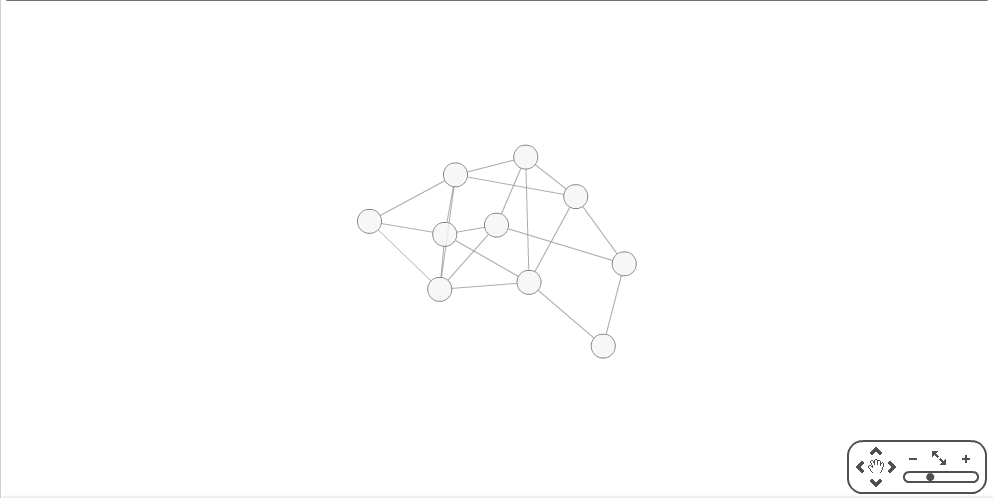
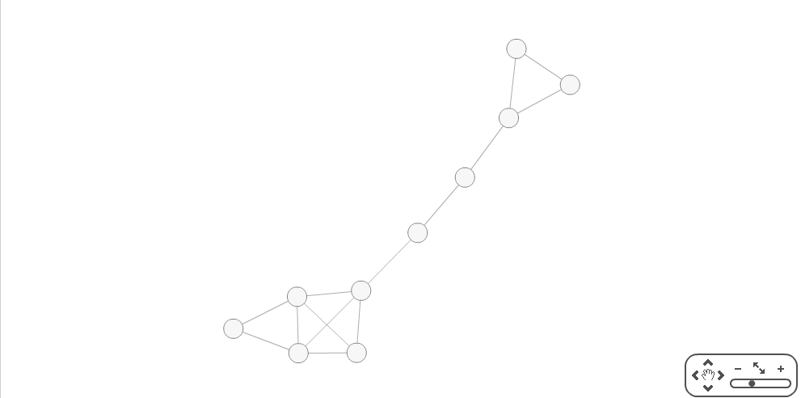
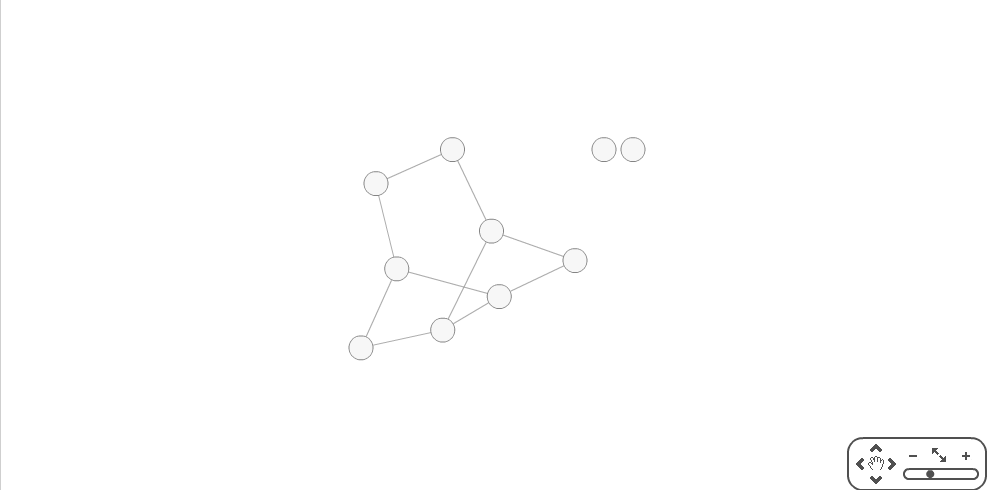

GraphGenerator
==============

This is a java app that can generate some graphs and then save them into GraphML format.

## Usage ##
Go to the GraphGenerator folder and run:
```
java -cp ./bin/ generator.misc.GraphGenerator GENERATOR_NAME NUMBER_OF_VERTEX (PROBABILITY)
```
GENERATOR_NAME and NUMBER_OF_VERTEX are required params, some algorithms need other params

Possible values for GENERATOR_NAME are:

* 'erdesh' - uses Erdes-Renyi algorithm for M edges. Params: N (vertex number), M (edges number)
* 'random' - uses Erdes-Renyi algorithm with p probability. Params: N (vertex number), p (connection probability)
* 'geometrical' - uses geometrical algorithm. Params: N (vertex number), p (connection radius)
* 'freescale' - uses Barabashi-Albert algorithm for creating scale-free graph. Params: N (vertex number)

The result of program is a ./graphs/graph.xml file written with GraphML markdown. You can visualize it on [this site](http://cytoscapeweb.cytoscape.org/demo).

## Examples ##
```
java -cp ./bin/ generator.misc.GraphGenerator erdesh 10 20
```


```
java -cp ./bin/ generator.misc.GraphGenerator random 10 0.4
```


```
java -cp ./bin/ generator.misc.GraphGenerator geometrical 10 0.4
```


```
java -cp ./bin/ generator.misc.GraphGenerator freescale 10
```

