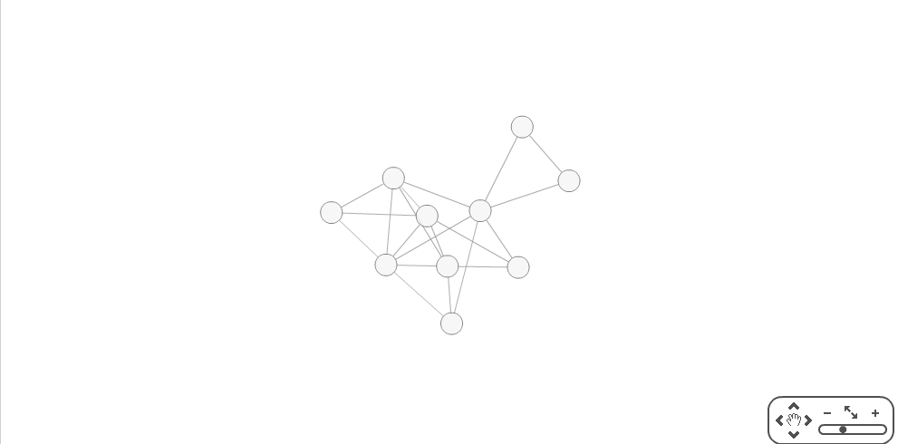

GraphGenerator
==============

This is a java app that can generate some graphs and then save them into GraphML format.

## Usage ##
Go to the GraphGenerator folder and run:
```
java -cp ./bin/ generator.misc.GraphGenerator GENERATOR_NAME NUMBER_OF_VERTEX (PROBABILITY)
```
GENERATOR_NAME and NUMBER_OF_VERTEX are required params, PROBABILITY is needed only for random and geometrical algorithms

Possible values for GENERATOR_NAME are:

* 'random' - uses Erdes-Renyi algorithm
* 'geometrical' - uses geometrical algorithm
* 'freescale' - uses Barabashi-Albert algorithm for creating scale-free graph

The result of program is a ./graphs/graph.xml file written with GraphML markdown. You can visualize it on [this site](http://cytoscapeweb.cytoscape.org/demo).

## Examples ##

```
java -cp ./bin/ generator.misc.GraphGenerator random 10 0.4
```


```
java -cp ./bin/ generator.misc.GraphGenerator geometrical 10 0.4
```


```
java -cp ./bin/ generator.misc.GraphGenerator freescale 10
```

